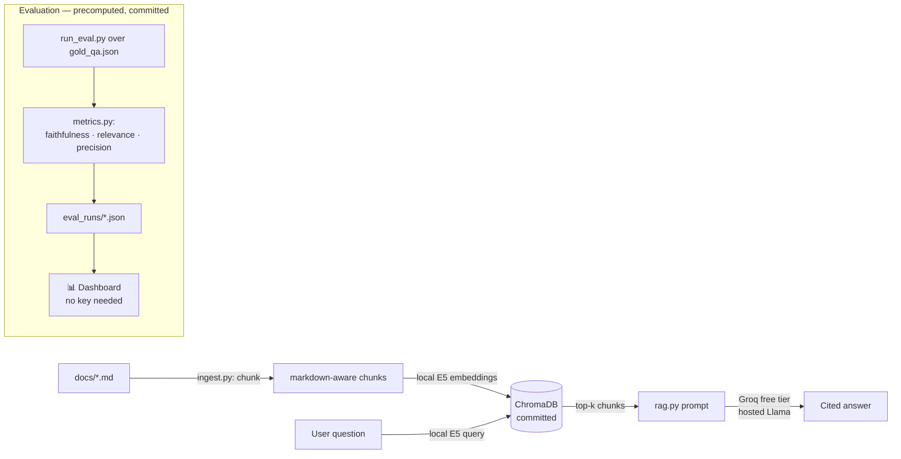

# 🧭 Daleel — RAG Q&A + Evaluation Dashboard

**Daleel** (*دليل*, "guide") is a retrieval-augmented Q&A assistant over a UAE
retail company's policy documents, plus an evaluation harness that proves the
pipeline is trustworthy. Ask a question, get an answer **with citations** to the
source documents — then open the dashboard to see how the pipeline scores on
**faithfulness**, **answer relevance**, and **context precision** across a gold
question set, including deliberately adversarial cases.

Built entirely on **free, open models**. A visitor clicking the demo link needs
nothing — no account, no API key, no setup.

> Two surfaces, one repo:
> 1. **RAG app** — chat over the corpus with cited answers.
> 2. **Evaluation dashboard** — per-question and aggregate metric scores, with a
>    config-comparison view (e.g. chunk 300 vs 500). *The "I gated a deployment
>    against benchmarks" story, made visual.*

<!-- TODO: add screenshots/GIF of both surfaces here -->
<!--  -->
<!--  -->

---

## Why this is genuinely free (the architecture)

An open model being free to *download* doesn't mean a stranger can *run* it from
a hosted link — someone has to provide compute at request time. The free
Streamlit host is CPU-only with tight memory: it can run a small embedding model,
but not a full Llama. So responsibilities are split:



| Concern | Choice | Why |
|---|---|---|
| **Embeddings** | `intfloat/multilingual-e5-small` via `sentence-transformers`, **local** | Small, CPU-friendly, runs on the free host. Multilingual → Arabic-ready. No key, no cost. |
| **Generation** | **Groq free tier** (hosted Llama) | Free host can't run Llama; Groq runs it on their servers. The **builder's** key is a host secret — visitors need nothing. |
| **Local/offline** | **Ollama** (`LLM_BACKEND=ollama`) | Same code path, fully offline dev. Shows the hosted-vs-local tradeoff. |
| **Vector store** | **ChromaDB**, persisted & committed | Small corpus → no build step on first load. |
| **Dashboard** | **Precomputed JSON**, committed | Zero keys, zero model, $0 — loads instantly no matter what. |

All model access sits behind a thin [`src/providers.py`](src/providers.py), so
the generation backend (Groq ↔ Ollama) and the embedding model are swappable by
config alone. **No paid API anywhere — including the LLM-as-judge eval**, which
calls the same free backend.

---

## The corpus & gold set

Six fictional **Najmah Retail Group** policy docs (`docs/`): employee handbook,
leave, benefits, returns, loyalty, data protection — which cross-reference each
other, enabling real multi-document retrieval.

The gold set ([`eval/gold_qa.json`](eval/gold_qa.json), 12 Qs) is built so scores
*can't* be trivially perfect:

- **q2** — numeric reasoning (end-of-service gratuity → AED 66,000)
- **q6 / q8** — multi-fact and **cross-document** (q8 needs returns *and* loyalty)
- **q10** — **unanswerable** (no gym benefit in the docs); the correct behaviour
  is **refusal**, scored as refusal accuracy, not faithfulness.

---

## Evaluation metrics

| Metric | How it's computed | Catches |
|---|---|---|
| **Faithfulness** | LLM-as-judge: fraction of the answer's factual claims supported by the retrieved context. *N/A for refusals.* | Hallucination |
| **Answer relevance** | Cosine similarity between question and answer embeddings (deterministic, no extra LLM call). | Off-topic answers |
| **Context precision** | Fraction of retrieved chunks drawn from the gold `source_docs`. *N/A for the unanswerable question.* | Bad retrieval |
| **Refusal accuracy** | Did the model correctly answer vs. refuse? | Over-confident answering / over-refusal |

Two runs with different chunk configs are committed under `eval/eval_runs/`, so
the dashboard's comparison view shows real metric deltas.

---

## Run it yourself

### A) Hosted-style, with your own free Groq key
```bash
# 1. Python 3.11 env (chroma-hnswlib ships wheels for 3.11; 3.12+ needs a C compiler on Windows)
uv venv --python 3.11 && uv pip install -r requirements.txt

# 2. Add a free Groq key (https://console.groq.com — no card)
cp .env.example .env   # then set GROQ_API_KEY=...

# 3. The vector store is committed — just run the app
.venv\Scripts\streamlit run app/Home.py        # Windows
# .venv/bin/streamlit run app/Home.py           # macOS/Linux
```

### B) Fully offline with Ollama
```bash
ollama pull llama3.1:8b
$env:LLM_BACKEND="ollama"      # PowerShell  (export LLM_BACKEND=ollama on bash)
.venv\Scripts\streamlit run app/Home.py
```

### Rebuild the index / regenerate eval runs (optional)
```bash
python -m src.ingest    --chunk-size 500 --overlap 75
python -m src.run_eval  --chunk-size 500 --overlap 75 --k 4
python -m src.run_eval  --chunk-size 300 --overlap 60 --k 4
```

The **dashboard needs no key**: `.venv\Scripts\streamlit run app/Home.py` then
open the *Evaluation* page, or run it as the main file on a key-less deploy.

---

## Deploy (Streamlit Community Cloud)

1. Push this repo to GitHub.
2. New app → main file `app/Home.py` → Python 3.11.
3. **Settings → Secrets:** `GROQ_API_KEY="..."` and `LLM_BACKEND="groq"`.
   The dashboard needs no secret; the live RAG mode reads the key from host
   secrets, so visitors need nothing.
4. First boot downloads the ~120 MB E5 model — fine on the free tier. The Chroma
   store and eval runs are committed, so there's no build step.

> This demo runs on free open models — local embeddings plus Groq-hosted Llama.
> No visitor data is stored. Mind Groq's free rate limits; the UI degrades
> gracefully if rate-limited.

---

## Repo layout
```
daleel-rag/
  docs/                    # corpus — 6 markdown policy docs
  eval/
    gold_qa.json           # 12 gold questions w/ ground truth + source docs
    eval_runs/             # committed precomputed eval results (dashboard reads these)
  src/
    config.py              # env-driven config (one place; Groq/Ollama switch)
    providers.py           # embeddings (local E5) + generation (Groq | Ollama)
    ingest.py              # docs -> markdown-aware chunks -> embed -> Chroma
    rag.py                 # retrieve + cited, grounded generation
    metrics.py             # faithfulness / answer_relevance / context_precision
    run_eval.py            # run RAG over gold set -> eval_runs/*.json
  app/
    Home.py                # RAG chat UI
    pages/1_Evaluation.py  # evaluation dashboard (no key needed)
  chroma/                  # persisted vector store (committed)
  requirements.txt
```

---

## Roadmap
- **Arabic corpus** — the embedding model is already multilingual; Arabic docs
  drop in without pipeline changes.
- **RAGAs integration** — swap the hand-rolled metrics for RAGAs on the same
  free backend.
- **Larger corpus** + an optional **reranker** stage for higher precision.

---

*Najmah Retail Group is fictional sample data. Any resemblance to real companies
is coincidental.*
